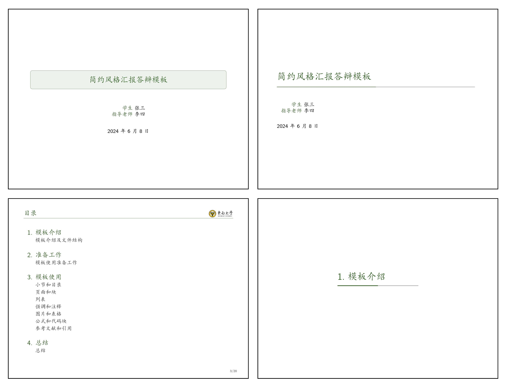
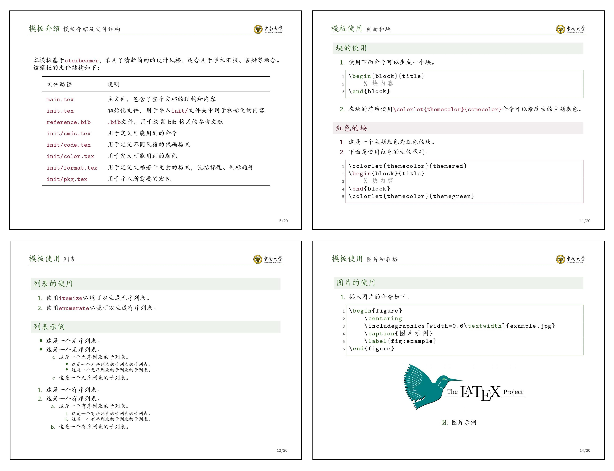
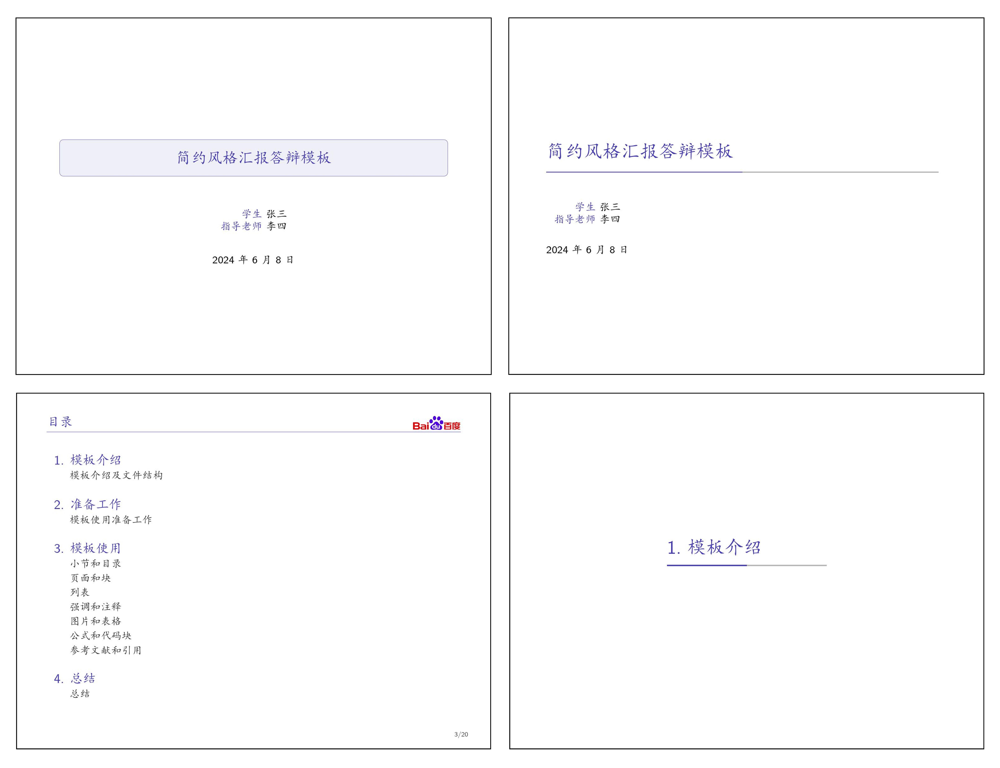
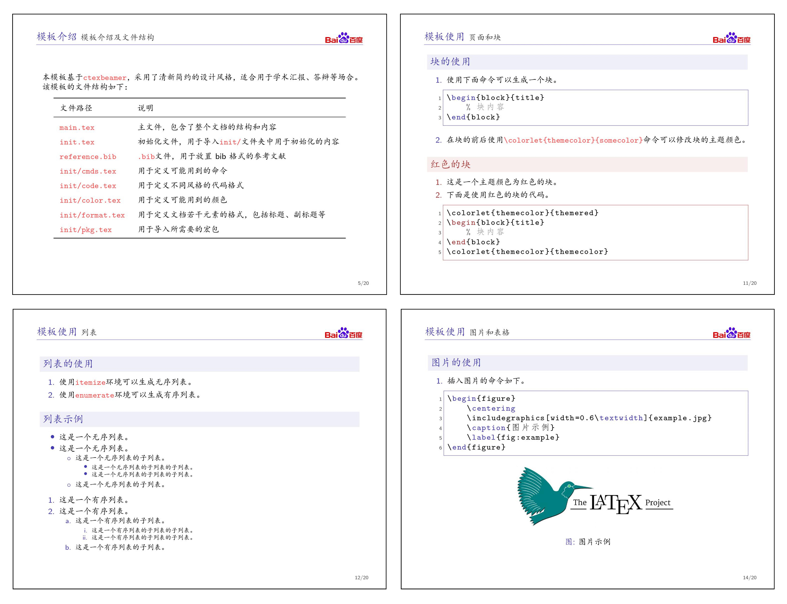

# Minimalist Slides

这是一个基于LaTeX Beamer的简约风格幻灯片模板，内置东南大学主题。用户可以通过简单的修改，轻松更换为其他学校或单位的主题。

## 特性

- 基于 `ctexbeamer`，适合中文环境
- 简约清新的设计风格，适用于学术汇报、答辩等场合
- 支持插入图片、表格、公式、代码块等
- 可自定义主题色

## 示例

- 以下为默认的东南大学主题样式：

  
  

- 通过修改logo和主题颜色，可创建符合百度风格的模板：

  
  

## 使用方法和更多细节

详见`main.pdf`文件。